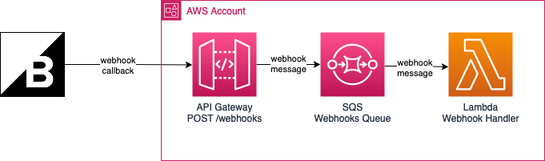

# BigCommerce Webhook Handler
A REST API handler for [BigCommerce webhook](https://developer.bigcommerce.com/api-docs/store-management/webhooks/about-webhooks) callbacks. Made with AWS resources - API Gateway, SQS, and Lambda.



# Create the Infrastructure
All infrastructure are deployed using [Terraform](https://developer.hashicorp.com/terraform/tutorials/aws-get-started/install-cli) with the AWS provider. 

## Authenticate the AWS Account
Make sure you have [authenticated your AWS account](https://docs.aws.amazon.com/cli/latest/userguide/sso-configure-profile-token.html#sso-configure-profile-token-auto-sso-session).

```
aws configure sso
```

## Build the Lambda Function Source Code
Go to the [`src`](./src/) directory. Install the dependencies and create a build.

```
npm install
node_modules/.bin/tsc -p tsconfig.json
```

## Apply the Terraform Configurations
Go to the [`infra`](./infra/) directory then initialize and apply the terraform configurations.

```
terraform init
terraform apply
```

# Process BigCommerce Webhook Callbacks
Place all processing logic for the BigCommerce webhook callbacks in the [`src/process.ts`](./src/process.ts) file.

``` ts
export function process(payload: BigCommerceCallbackPayload) {
    // Create the processing logic for a BigCommerce callback payload here.
}
```
